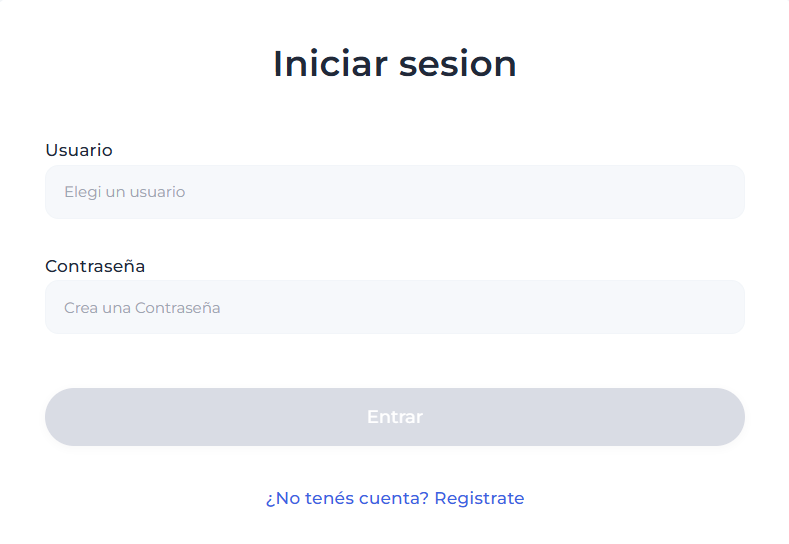
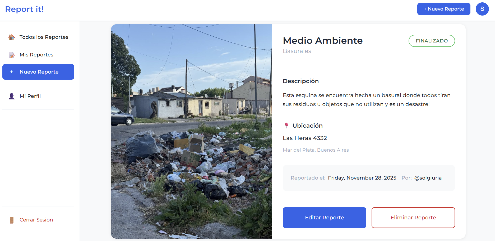
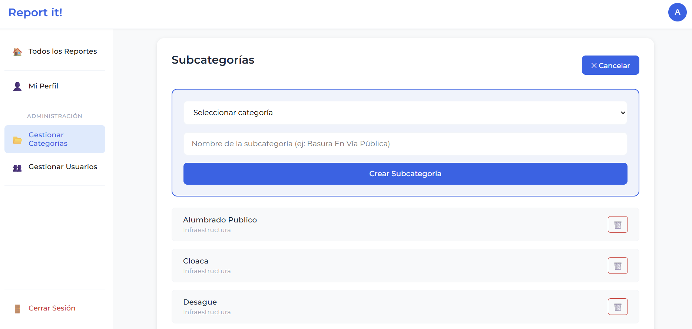

# 🏙️ Report it! - Frontend

Web application for civic issue reporting that allows citizens to report urban problems and administrators to manage requests efficiently.

**Final Project - Programming IV**  
University Technical Degree in Programming  
National Technological University - Mar del Plata Regional Faculty

**Author:** Maria Sol Giuria  
**Year:** 2025

---

## 📋 Description

Report it! is a web application designed to improve communication between citizens and local government. Users can report urban problems (potholes, public lighting, trash dumps, etc.) with images and details, while administrators can manage categories, users, and report statuses.

---

## ✨ Main Features

### 👤 Regular User
- ✅ Secure registration and login
- ✅ Create reports with optional image (up to 10MB)
- ✅ View all community reports
- ✅ Filter reports by category, subcategory, and status
- ✅ Manage their own reports (view, edit, delete)
- ✅ Change password from profile

### 👨‍💼 Administrator
- ✅ View all system reports
- ✅ Change report status (Pending → In Progress → Completed)
- ✅ Manage categories and subcategories
- ✅ Manage registered users
- ✅ Filter reports by category, subcategory, and status

---

## 🖼️ Screenshots

### Login Screen


### Reports List


### Report Detail


### Create Report


### User Profile


### Admin Panel


---

## 🛠️ Technologies Used

- **Angular 20.3** - Main framework
- **TypeScript** - Programming language
- **Signals** - Reactive state management
- **Standalone Components** - Modern Angular architecture
- **Reactive Forms** - Reactive forms with validations
- **HTTP Client** - REST API communication
- **CSS3** - Custom styles with CSS variables

---

## 📦 Prerequisites

- **Node.js** (v22)
- **Angular CLI** (v20)

---


## 🔌 Backend Configuration

The frontend connects to the backend at `http://localhost:8080`. 

If you need to change this URL, modify the `apiUrl` constant in each service inside `src/app/core/services/`.

**Example:**
```typescript
private readonly apiUrl = 'http://localhost:8080/reportes';
```

---

## 📁 Project Structure
```
src/
├── app/
│   ├── core/                     # Services, interceptors, guards
│   │   ├── guards/               # Authentication guards
│   │   ├── interceptors/         # JWT interceptor
│   │   └── services/             # HTTP services
│   ├── models/                   # TypeScript interfaces
│   ├── pages/                    # Page components
│   │   ├── admin/                # Administration pages
│   │   │   ├── category-management-page/
│   │   │   ├── user-list-page/
│   │   │   └── user-detail-page/
│   │   ├── auth/                 # Login and registration
│   │   │   ├── auth-page/
│   │   │   └── auth-form/
│   │   ├── reports/              # Report management
│   │   │   ├── report-list-page/
│   │   │   ├── report-detail-page/
│   │   │   └── report-form-page/
│   │   └── users/                # User profile
│   │       └── profile-page/
│   ├── shared/                   # Shared components
│   │   ├── header/
│   │   └── sidebar/
│   ├── app.component.ts          # Root component
│   ├── app.routes.ts             # Routes configuration
│   └── app.config.ts             # Application configuration
├── styles.css                    # Global styles
└── index.html                    # Main HTML
```

---

## 🎨 Design Features

- **Responsive Design**: Adapts to mobile, tablet, and desktop
- **Modern UI**: Clean interface with blue color palette (#2563eb)
- **Visual Feedback**: Clear loading states, errors, and confirmations
- **Accessibility**: Large buttons, proper contrast, descriptive labels
- **Smooth Animations**: CSS transitions for better UX

---

## 🔐 Security Features

- **JWT Authentication**: Secure tokens stored in localStorage
- **Route Guards**: Route protection based on role (user/admin)
- **HTTP Interceptor**: Automatic JWT token injection in all requests
- **Form Validation**: Reactive validations in all forms
- **Error Handling**: Centralized HTTP error management

---

## 🚧 Future Improvements

- [ ] Implement lazy loading to optimize initial load
- [ ] Add interactive map for report location
- [ ] Allow multiple images per report
- [ ] Implement real-time notification system
- [ ] Add dark mode
- [ ] Implement PWA (Progressive Web App)
- [ ] Add text search
- [ ] Add charts and statistics

---

## 🐛 Known Issues (To improve!)

- Report editing does not allow changing the associated image
- Admin profile may not load if the admin user was not created through the normal registration flow

---

## 🔗 Backend Repository

This frontend works together with the backend developed in Spring Boot.

**Repository:** [Report it! - Backend](https://github.com/solgiuria/TPFINAL)

---

## 👩‍💻 Author

**Maria Sol Giuria**  
Student of University Technical Degree in Programming  
National Technological University - Mar del Plata Regional Faculty  

---


⭐ If you liked this project, leave a star on GitHub!
